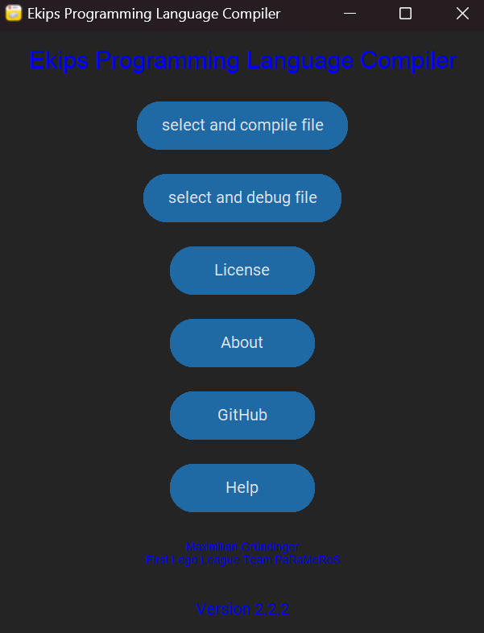
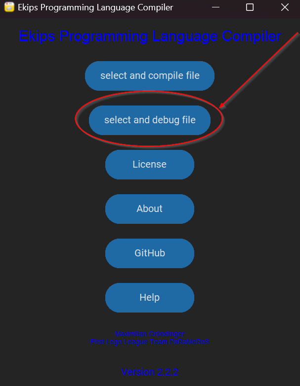
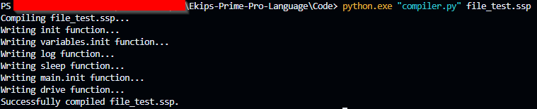
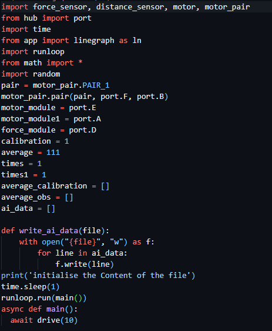
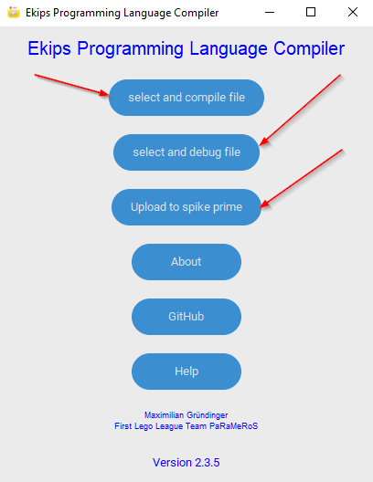
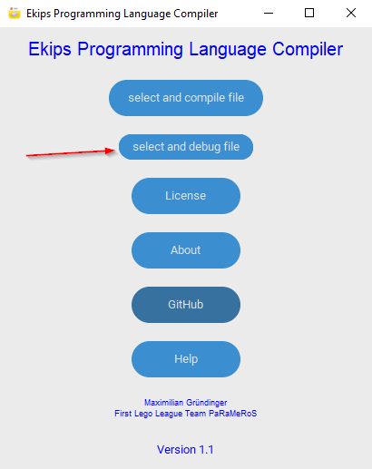
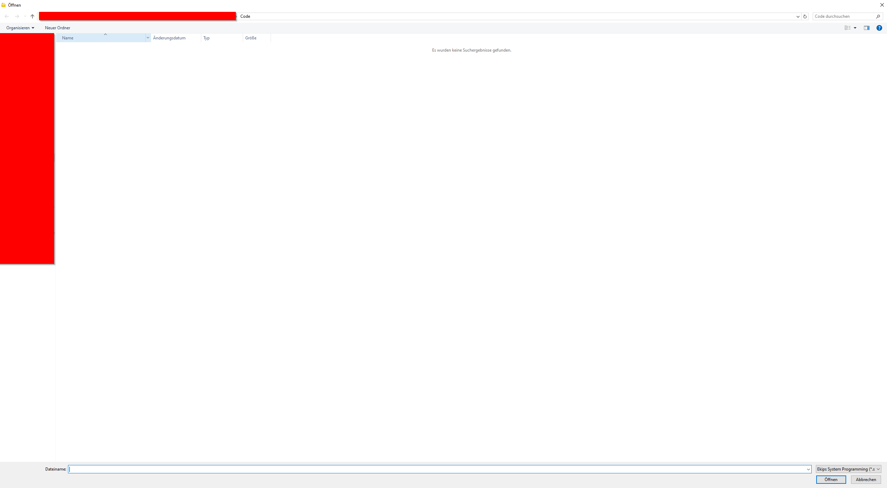

# Spike Custom Programming Language and Compiler

## Introduction

Welcome to the documentation for Spike Custom System Programming! This guide will provide you with all the information you need to get started with programming in Spike Custom System Programming.
This programm is programmd to implement the Spike Prime Hub software with a easy and straight forward Programming Language that compiles in a .py file that you can put in the [Official Spike Prime Software](https://education.lego.com/de-de/downloads/spike-app/software/), this will be integratet in an future update, also the full ai functionalities will be added in v3.0

## Table of Contents

- [Installation](#installation)
- [Syntax](#syntax)
- [Functions](#functions)
- [Examples](#examples)
- [Guide](#guide)

## Installation

To use the Spike Custom System Programming Language, you need to install the compiler and Debuger. Follow the instructions below to get started:

1. Download the latest version of the Spike Custom System Programming Language compiler from the official website or from the [github repository](https://github.com/Spike-Prime-Pro/Spike-Custom-Programming-Language-and-Compiler/releases).
2. Install the compiler on your system by running the installer.
3. Verify the installation by opening a terminal and running the programm.
4. If there is any Problem please send a Email to <Iron.ai.dev@gmail.com> for bug fixing.

## Syntax

The Spike Custom System Programming Language has a simple and intuitive syntax that is easy to read and write. Here are some key features of the syntax:

- The functions are the key part of the Programm like `sleep{10}` (`sleep`).
- The curly brackets define function uneque variables like `wait{1}` (`{}`).

## Functions

The main functions of the Spike Custom System Programming Language are for the basic use of the Spike Prime Custom Operating System and programming with ai enforced functions. To use the functions you have to first initialize the functions with the `init{}`, `drive.init{}`, `module.init{}`, `ai.init{}`, `calibration.init{}`, `variables.init{}` and `sensor.init{}` functions.
There are four build in functions.

- The `drive` function is for driving a motorpair forward and backward.
- The `tank` function is for making turns.
- The `module` function is for controling a single motor.
- The `calibration` function is for calibrating the robot and it motors, it also enhances the ai's capabilities.
- The `ai` function is for controling the artificial inteligence which is build in for every module if there are datasets to build from, for this there will be an extra Guide.
- The `sensor` function is for controling the Input for the artificial inteligence.
- The `sleep` function will hold the programm for a few moments.
- The `log` function will print any value you give it.

## Examples

The best way to learn the language you have to remeber the syntax and the functions but then you have to practice. The following code examples will show you how to begin after you have try'd it you can open the Examples.md file and learn more about the Spike Custom System Programming Language.

1. `drive{10}`
2. `module{100}`
3. `sensor{color}`
4. `ai_train_data_save{data_file}` or `ai_train_data_load{data_file}` or `ai_model_chose{supervised_learning}`
5. `log{Hello World}`
6. `calibrate{}`
7. `tank{30}`

## Guide

This will show you how to work with the python cli version:
1. You have to create an .ssp file, you can use for that any texteditor or our own [Ekips Texteditor](https://github.com/Ekips-Prime-Pro/Ekips-Prime-Pro-Editor) that is optimised for this. In my case I have written a little test progamm, please follow the systax rules and use only the functions that are show in [Functions](#functions).
 
2. If you want to check for any errors befor you compile the file use the debuger.py like the following picture shows.
 
3. Next you can compile the .ssp file into an .py file that you can just paste in the offical [Spike Prime Software](https://spike.legoeducation.com/). But first we have to run the compiler, you can write `-h` for help. But we will convert it with the following command:
 
4. Now you can open the .py file in the text editor and copy the content into youre offical [Spike Prime Software](https://spike.legoeducation.com/):
 
5. Now you can write a new programm change things.

This will show you how to work with the .exe GUI version:
1. First you have to run the programm then you see a menu with a few options: 

2. if you click on the both buttons that are pointet at you will come to the following menu that will let you chose the file that you want to compile or debug:

3. If you have chosen you`re file that will automaticly debug or compile the Programm, like in the cli version if you let it compile you're programm you get an .py file that you can copy in the offical [Spike Prime Software](https://spike.legoeducation.com/) and upload to you're Spike Prime.

## Conclusion

This guide has provided you with all the information you need to get started with programming in Spike Custom System Programming. If you have any questions or need further assistance, please refer to the official documentation or contact the support team.
Thank you for choosing Spike Custom System Programming! We hope you enjoy using our programming language and look forward to seeing what you create.

## License

[Apache License](http://www.apache.org/licenses/)
Version 2.0, January 2004

Maximilian Gründinger, 04.03.2024 

## Contact

If you have any questions or need further assistance, please contact us at <iron.ai.dev@gmail.com>
