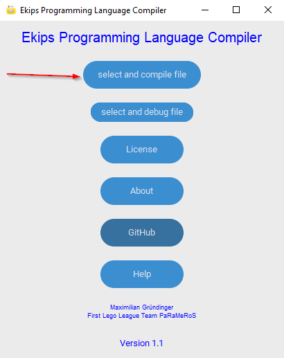

# Spike Custom Programming Language

[](https://github.com/Spike-Prime-Pro/Spike-Custom-Programming-Language-and-Compiler/actions/workflows/python-app.yml)

## Introduction

Welcome to the documentation for Spike Custom System Programming! This guide will provide you with all the information you need to get started with programming in Spike Custom System Programming.
This programm is programmd to implement the Spike Prime Hub software with a easy and straight forward Programming Language that compiles in a .llsp3 file that you can put in the [Official Spike Prime Software](https://education.lego.com/de-de/downloads/spike-app/software/), this will be integratet in an future update, also the full ai functionalities will be added in v3.0

## Table of Contents

- [Installation](#installation)
- [Syntax](#syntax)
- [Functions](#functions)
- [Examples](#examples)
- [Full example with explaination](#full-example-with-explaination)
- [Guide](#guide)

## Installation

To use the Spike Custom System Programming Language, you need to install the compiler and Debuger. Follow the instructions below to get started:

1. Download the latest version of the Spike Custom System Programming Language compiler from the official website or from the [github repository](https://github.com/Spike-Prime-Pro/Spike-Custom-Programming-Language-and-Compiler/releases).
2. Install the compiler on your system by running the installer.
3. Verify the installation by opening a terminal and running the programm.
4. If there is any Problem please send a Email to <Iron.ai.dev@gmail.com> for bug fixing.

## Syntax

The Spike Custom System Programming Language has a simple and intuitive syntax that is easy to read and write. Here are some key features of the syntax:

- The functions are the key part of the Programm like `sleep{10}` (`sleep`).
- The curly brackets define function uneque variables like `wait{1}` (`{}`).
- Coments have to be after an `//` or an `#` also the content has to be enclosed in curly brackets, like that `//{you coment}`

## Functions

The main functions of the Spike Custom System Programming Language are for the basic use of the Spike Prime Custom Operating System and programming with ai enforced functions. To use the functions you have to first initialize the functions with the `init{}`, `drive.init{}`, `module.init{}`, `ai.init{}`, `calibration.init{}`, `variables.init{}` and `sensor.init{}` functions.
There are four build in functions.

- The `drive` function is for driving a motorpair forward and backward.
- The `tank` function is for making turns.
- The `module` function is for controling a single motor.
- The `calibration` function is for calibrating the robot and it motors, it also enhances the ai's capabilities.
- The `ai` function is for controling the artificial inteligence which is build in for every module if there are datasets to build from, for this there will be an extra Guide.
- The `sensor` function is for controling the Input for the artificial inteligence.
- The `sleep` function will hold the programm for a few moments.
- The `log` function will print any value you give it.

## Examples

The best way to learn the language you have to remeber the syntax and the functions but then you have to practice. The following code examples will show you how to begin after you have try'd it you can open the Examples.md file and learn more about the Spike Custom System Programming Language.

1. `drive{10}`
2. `module{100}`
3. `sensor{color}`
4. `ai_train_data_save{data_file}` or `ai_train_data_load{data_file}` or `ai_model_chose{supervised_learning}`
5. `log{Hello World}`
6. `calibrate{}`
7. `tank{30}`

## Full example with explaination

At the beginning you have to initialize the functions with the `init{}`, `variables.init{}`, `ai.init{}`, `module.init{}`, `motor.init{}`, `sensor.init{}` and `calibration.init{}` functions. After that you have to start the main loop with the `main{}` function. In the main loop you can use the functions that are shown in [Functions](#functions). The following example shows a simple program that drives the robot forward, turns left, and then drives forward again.

```c
//{This is a simple example of a Spike Custom System Programming Language program. Without ai.}
init{}
variables.init{}
module.init{}
motor.init{}
sensor.init{}
calibration.init{}
log{Running main Function}
main.init{}
drive{10}
tank{30}
drive{10}
main.run{}
```

Out of that you become some Code in a .py file that will be also available.
```python
# This is a simple example of a Spike Custom System Programming Language program. Without ai.
import force_sensor, distance_sensor, motor, motor_pair
from hub import port
import time
from app import linegraph as ln
import runloop
from math import *
import random
pair = motor_pair.PAIR_1
motor_pair.pair(pair, port.F, port.B)
motor_module = port.E
motor_module1 = port.A
force_module = port.D
calibration = 1
average = 111
times = 1
times1 = 1
average_calibration = []
average_obs = []
ai_data = []

def write_ai_data(file):
    with open("{file}", "w") as f:
        for line in ai_data:
            f.write(line)
#Module function
async def module(degrees=0, speed=1110, acceleration=10000):
    if (degrees > 0):
        await motor.run_for_degrees(motor_module, degrees, speed, acceleration=acceleration)
    elif (degrees < 0):
        await motor.run_for_degrees(motor_module, degrees, speed, acceleration=acceleration)
    elif (degrees == 0):
        print("Error")
#Drive function
async def drive(distance=0, multiplier=14, speed=1000, acceleration=1000):
    if (distance > 0):
        degrees = multiplier*(distance - calibration)
        await motor_pair.move_for_degrees(pair, degrees, 0, velocity=speed, acceleration=acceleration)
    elif (distance < 0):
        degrees = multiplier*(distance + calibration)
        await motor_pair.move_for_degrees(pair, degrees, 0, velocity=speed, acceleration=acceleration)
    elif (distance == 0):
        print("Null Value Error")

#Tank function
async def tank(degrees=0, left_speed=1000, right_speed=1000, acceleration=1000):
    #180 degrees = 90 Grad
    if (degrees > 0):
        await motor_pair.move_tank_for_degrees(pair, -degrees, left_speed, -right_speed, acceleration=acceleration)
    elif (degrees < 0):
        await motor_pair.move_tank_for_degrees(pair, degrees, -left_speed, right_speed, acceleration=acceleration)
    elif (degrees == 0):
        print("Null Value Error")

#Obstacle function
async def obstacle(distance=0, speed=1000, acceleration=1000):
    if (distance > 0):
        while distance_sensor.distance(port.C) > distance:
            await drive(2, 14, speed, acceleration)
        print("Obstacle detected!")
        #print(distance_sensor.distance(port.C))
    elif (distance <= 0):
        print("Null Value Error")#Switch function
async def switch(switch=False):
    while switch == False:
        if (force_sensor.force(force_module) >= 50):
            switch = True
            return True
#Calibrate function
async def calibrate(speed=1000, acceleration=1000):
        if (distance_sensor.distance(port.C) < 110):
            print("Calibration not possible! | Distance to small!")
        elif (distance_sensor.distance(port.C) > 110):
            try:
                await drive(-1, 14, speed, acceleration)
                distance0 = distance_sensor.distance(port.C)
                await drive(10, 14, speed, acceleration)
                distance1 = distance_sensor.distance(port.C)
                calibration = distance0 - distance1
                #print("Calibration done!")
                print(calibration)
                wait(0.5)
            except:
                print("Calibration not possible! | Error!")
print('Running main Function')
async def main():
  await drive(10)
  await tank(30)
  await drive(10)
runloop.run(main())

```

The .llsp3 file you can put in the [Spike Prime Software](https://spike.legoeducation.com/) and then load on you're Spike Prime.

## Guide

This will show you how to work with the python cli version:

1. You have to create an .scsp  file, you can use for that any texteditor or our own [Ekips Texteditor](https://github.com/Ekips-Prime-Pro/Ekips-Prime-Pro-Editor) that is optimised for this. In my case I have written a little gui to help you with the programm.
   

 
2. If you want to check for any errors in the programm that you have written you can just run the Debugger it will give you an allert if something is not wright.

 

3. Next you can compile the .ssp file into an .py and .llsp3 file that you can just paste in the offical [Spike Prime Software](https://spike.legoeducation.com/). But we will convert it with the following command:

 

4. Now you can open the .py file in the text editor and copy the content into youre offical [Spike Prime Software](https://spike.legoeducation.com/):

 

5. Now you can write a new programm change things.

This will show you how to work with the .exe GUI version:

1. First you have to run the programm then you see a menu with a few options:

  

2. if you click on the both buttons that are pointet at you will come to the following menu that will let you chose the file that you want to compile or debug:


3. If you have chosen you`re file that will automaticly debug or compile the Programm, like in the cli version if you let it compile you're programm you get an .py file that you can copy in the offical [Spike Prime Software](https://spike.legoeducation.com/) and upload to you're Spike Prime.

## Conclusion

This guide has provided you with all the information you need to get started with programming in Spike Custom System Programming. If you have any questions or need further assistance, please refer to the official documentation or contact the support team.
Thank you for choosing Spike Custom System Programming! We hope you enjoy using our programming language and look forward to seeing what you create.

## License

[Apache License](http://www.apache.org/licenses/)
Version 2.0, January 2004

Maximilian Gründinger, 04.03.2024

## Contact

If you have any questions or need further assistance, please contact us at <iron.ai.dev@gmail.com>
